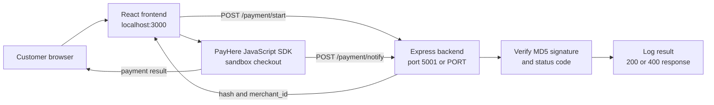

# High-Level Design (HHL)

## 1. Purpose

PayHere Payment Integration Demo is a web application that demonstrates how a React frontend can start a PayHere sandbox payment through an Express backend. The backend generates the PayHere payment hash and receives the server-to-server payment notification.

## 2. Scope

### In scope

- Collect a fixed demo order and customer details in the frontend.
- Generate a PayHere-compatible MD5 hash on the backend.
- Launch the PayHere sandbox checkout from the browser.
- Receive and verify PayHere payment notifications.
- Allow local frontend development with a CORS policy for `http://localhost:3000`.

### Out of scope in the current implementation

- User accounts and authentication.
- Persistent orders, transactions, or customer records.
- Refunds, captures, subscriptions, or reconciliation.
- Payment success and cancellation pages.
- Production secret management, observability, and retry processing.

## 3. Architecture

## 4. Main Components

| Component | Responsibility | Technology |
|---|---|---|
| Frontend shell | Renders the payment page | React 18, Create React App |
| `PaymentButton` | Builds the demo payment, requests a hash, starts PayHere | React, Fetch API |
| Backend application | JSON and URL-encoded parsing, CORS, route registration | Node.js, Express |
| Payment route | Hash generation and notification verification | Express Router, Node `crypto` |
| PayHere SDK | Hosted payment checkout and notification delivery | PayHere JavaScript SDK |

## 5. Primary Flow

1. The customer clicks **PayHere Pay**.
2. The frontend sends `order_id`, `amount`, and `currency`, along with customer data, to `POST /payment/start`.
3. The backend combines merchant data, order data, currency, and the MD5 merchant secret hash to create the payment hash.
4. The frontend receives `hash` and `merchant_id` and calls `payhere.startPayment(...)`.
5. PayHere processes the payment in sandbox mode.
6. PayHere sends a notification to `POST /payment/notify`.
7. The backend recomputes the notification signature and accepts only a matching signature with status code `2`.

## 6. Deployment View

- Frontend: static React build served from a web host.
- Backend: Node.js process behind HTTPS and a public hostname.
- PayHere: sandbox during development; production PayHere configuration for release.
- Notify URL: must be publicly reachable by PayHere. An ngrok tunnel can be used for local testing.

## 7. Key Risks and Production Requirements

- Move `merchant_id` and `merchant_secret` to server-side environment variables or a secret manager.
- Never expose the merchant secret to the browser or commit it to source control. The current repository contains a credential placeholder/value that should be rotated before production use.
- Validate input types, amount precision, currency, and order ownership on the backend.
- Persist an order before starting payment and make notification processing idempotent.
- Use HTTPS, restrictive CORS, structured logs, rate limiting, and monitoring.
- Treat the notification endpoint as the authoritative payment status source; browser return URLs are not proof of payment.
