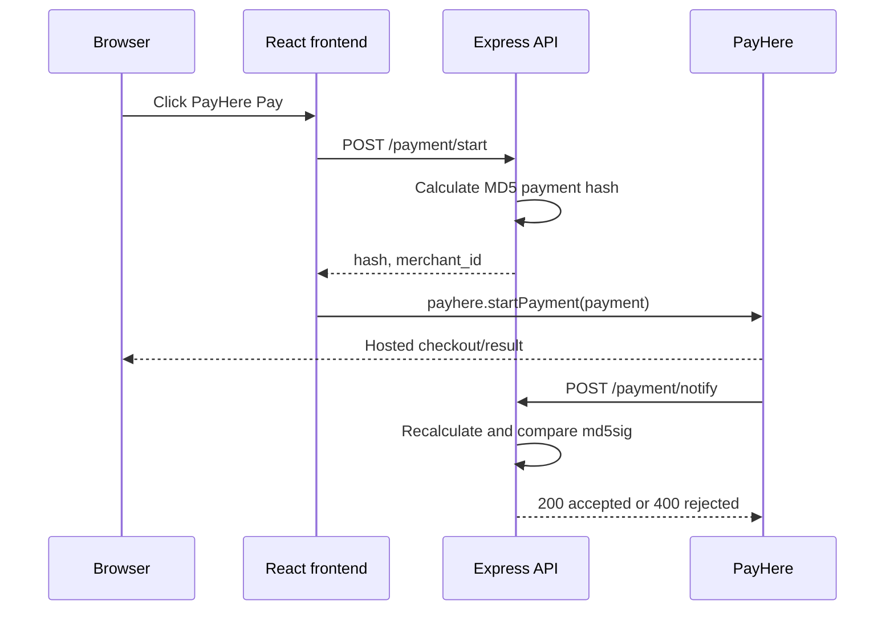

# Low-Level Design (LLD)

## 1. Project Structure

```text
backend/
  app.js                 Express bootstrap and middleware
  routes/payment.js      Payment hash and notification endpoints
  package.json           Backend scripts and dependencies
frontend/
  public/index.html      React host page and PayHere SDK script
  src/App.js             Page composition
  src/components/
    PaymentButton.js     Payment request and PayHere startup
  src/index.js           React entry point
  src/index.css          Global styles
```

## 2. Backend Details

### `backend/app.js`

- Creates an Express application.
- Parses JSON and URL-encoded request bodies.
- Allows requests from `http://localhost:3000` using CORS.
- Mounts the payment router at `/payment`.
- Listens on `process.env.PORT` or port `5001`.

### `POST /payment/start`

Request body:

```json
{
  "order_id": "ItemNo12345",
  "amount": "1005.00",
  "currency": "LKR"
}
```

Current response:

```json
{
  "hash": "UPPERCASE_MD5_HASH",
  "merchant_id": "MERCHANT_ID"
}
```

Hash algorithm:

```text
secret_hash = MD5(merchant_secret).toUpperCase()
hash = MD5(merchant_id + order_id + amount + currency + secret_hash).toUpperCase()
```

The current endpoint logs the order ID and returns the calculated hash. It does not yet validate the request or create a database order.

### `POST /payment/notify`

PayHere sends form-encoded notification fields including:

```text
merchant_id
order_id
payhere_amount
payhere_currency
status_code
md5sig
```

Verification algorithm:

```text
secret_hash = MD5(merchant_secret).toUpperCase()
local_md5sig = MD5(
  merchant_id + order_id + payhere_amount + payhere_currency + status_code + secret_hash
).toUpperCase()
```

Behavior:

- If `local_md5sig === md5sig` and `status_code == "2"`, respond `200`.
- Otherwise, respond `400`.
- Current success handling logs the payment; it does not update persistent storage.

## 3. Frontend Details

### `App`

Renders the page heading and `PaymentButton`.

### `PaymentButton`

1. Defines the fixed demo payment and customer data.
2. Sends a `POST` request to the configured backend `/payment/start` endpoint.
3. Reads `hash` and `merchant_id` from the response.
4. Builds the PayHere configuration object.
5. Calls the global `payhere.startPayment(payment)` function.

The PayHere SDK is loaded by `frontend/public/index.html` from `https://www.payhere.lk/lib/payhere.js`. The payment is configured with `sandbox: true`.

## 4. API Sequence



## 5. Error Handling

- Network or API errors are caught and logged by the frontend.
- A non-2xx hash response is logged as a hash-generation failure.
- Invalid notification signatures receive HTTP `400`.
- There is currently no user-visible error state, timeout handling, retry policy, request correlation ID, or centralized backend error middleware.

## 6. Configuration and Security

Current configuration is embedded in source code, including merchant credentials and deployment URLs. The target configuration should be:

```text
PORT=5001
FRONTEND_ORIGIN=http://localhost:3000
PAYHERE_MERCHANT_ID=...
PAYHERE_MERCHANT_SECRET=...
PAYHERE_NOTIFY_URL=https://api.example.com/payment/notify
PAYHERE_RETURN_URL=https://app.example.com/payment/success
PAYHERE_CANCEL_URL=https://app.example.com/payment/cancel
```

The merchant secret must remain backend-only. Input validation should reject missing fields, malformed amounts, unsupported currencies, and unexpected order IDs. Notification updates should be idempotent using `order_id` and the provider transaction identifier.

## 7. Testing Strategy

- Unit test payment hash generation with known inputs.
- Unit test valid, invalid, and non-success notification signatures.
- API test missing and malformed `/payment/start` fields.
- API test duplicate notifications and already-completed orders.
- Frontend test that a successful hash response calls `payhere.startPayment` with the expected fields.
- Manual sandbox test using a public notify URL.
